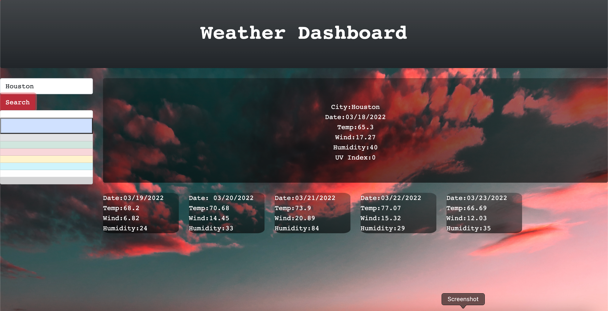

## Objective

A weather outlook for multiple cities
that displays multiple data querys. 
Such as:

- Date
- Temperature
- Wind speed
- Humidity

## Task

A weather dashboard with form inputs 
Able to search for a city
Presented with current and future conditions for that city and that city is added to the search history
THEN I am presented with the city name, the date, an icon representation of weather conditions, the temperature, the humidity, the wind speed, and the With UV index user is presented with a color that indicates whether the conditions are favorable, moderate, or severe
Future weather conditions for that city are displayed
A presentetation of a 5-day forecast that displays the date, an icon representation of weather conditions, the temperature, the wind speed, and the humidity
## Screenshots

## Contributions

Worked with:

- Phil Loy

## License

This is licensed under the MIT License.
